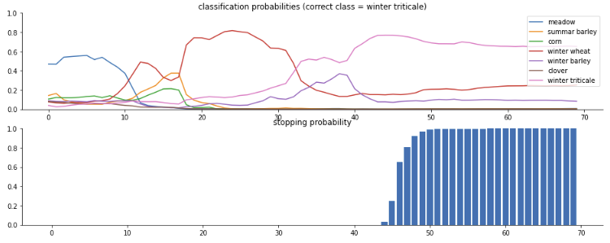
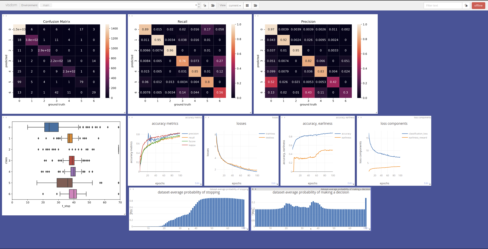

# End-to-end Learning for Early Classification of Time Series (ELECTS)

## Dependencies

```
conda create -n elects
conda activate elects
pip install -r requirements.txt
```

## Getting Started:

Test model predictions on the evaluation set with Jupyter
Notebook provided in `elects.ipynb`



## Run Training Loop

### Monitor training visally (optional)

start [visdom](https://github.com/fossasia/visdom) server for visual training progress
```bash
❯ visdom
Checking for scripts.
It's Alive!
INFO:root:Application Started
You can navigate to http://localhost:8097
```
and navigate to [http://localhost:8097/](http://localhost:8097/) in the browser of your choice.



### Start training loop

To start the training loop run
```
❯ python train.py
Setting up a new session...
epoch 100: trainloss 1.70, testloss 1.97, accuracy 0.87, earliness 0.48. classification loss 7.43, earliness reward 3.48: 100%|███| 100/100 [06:34<00:00,  3.95s/it]
```
The BavarianCrops dataset is automatically downloaded.
Additional options (e.g., `--alpha`, `--epsilon`, `--batchsize`) are available with `python train.py --help`.

## Docker

It is also possible to install dependencies in a docker environment
```
docker build -t elects .
```
and run the training script
```
docker run elects python train.py
```


## Additional Notes

* This repository is a distillation of the central loss early-reward function,
  the LSTM-RNN model on the BavarianCrops dataset. This code is designed for easy reproducability and applicability.
  The original (explorative) repository is available under https://github.com/rtavenar/elects.
