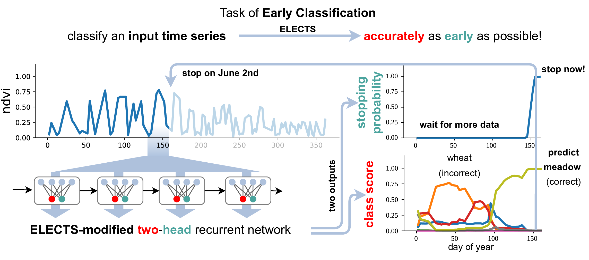

# ELECTS: End-to-End Learned Early Classification of Time Series for In-Season Crop Type Mapping



please cite
> Marc Rußwurm, Nicolas Courty, Remi Emonet, Sebastien Lefévre, Devis Tuia, and Romain Tavenard (2023). End-to-End Learned Early Classification of Time Series for In-Season Crop Type Mapping. ISPRS Journal of Photogrammetry and Remote Sensing. 196. 445-456. https://doi.org/10.1016/j.isprsjprs.2022.12.016

```
@article{russwurm2023:ELECTS,
  title = {End-to-end learned early classification of time series for in-season crop type mapping},
  journal = {ISPRS Journal of Photogrammetry and Remote Sensing},
  volume = {196},
  pages = {445-456},
  year = {2023},
  issn = {0924-2716},
  doi = {https://doi.org/10.1016/j.isprsjprs.2022.12.016},
  url = {https://www.sciencedirect.com/science/article/pii/S092427162200332X},
  author = {Marc Rußwurm and Nicolas Courty and Rémi Emonet and Sébastien Lefèvre and Devis Tuia and Romain Tavenard},
}
```

paper available at https://www.sciencedirect.com/science/article/pii/S092427162200332X

[arxiv preprint here](https://arxiv.org/pdf/1901.10681.pdf)

## Dependencies

```
python -m venv venv
source venv/bin/activate
pip install -r requirements.txt
```

## Getting Started:

Test model predictions on the evaluation set with Jupyter
Notebook provided in `elects.ipynb`


## Run Training Loop

### Monitor training visally (optional)

start [visdom](https://github.com/fossasia/visdom) server for visual training progress
```bash
❯ visdom
Checking for scripts.
It's Alive!
INFO:root:Application Started
You can navigate to http://localhost:8097
```
and navigate to [http://localhost:8097/](http://localhost:8097/) in the browser of your choice.


### Start training loop

To start the training loop run
```
❯ python train.py
Setting up a new session...
epoch 100: trainloss 1.70, testloss 1.97, accuracy 0.87, earliness 0.48. classification loss 7.43, earliness reward 3.48: 100%|███| 100/100 [06:34<00:00,  3.95s/it]
```
The BavarianCrops dataset is automatically downloaded.
Additional options (e.g., `--alpha`, `--epsilon`, `--batchsize`) are available with `python train.py --help`.

## Docker

It is also possible to install dependencies in a docker environment
```
docker build -t elects .
```
and run the training script
```
docker run elects python train.py
```


python train.py --dataroot /data/sustainbench --dataset ghana
python train.py --dataroot /data/sustainbench --dataset southsudan

--dataroot /data/sustainbench --dataset southsudan --epochs 500
